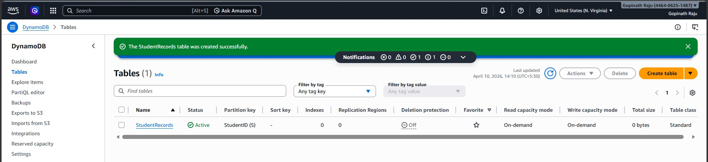
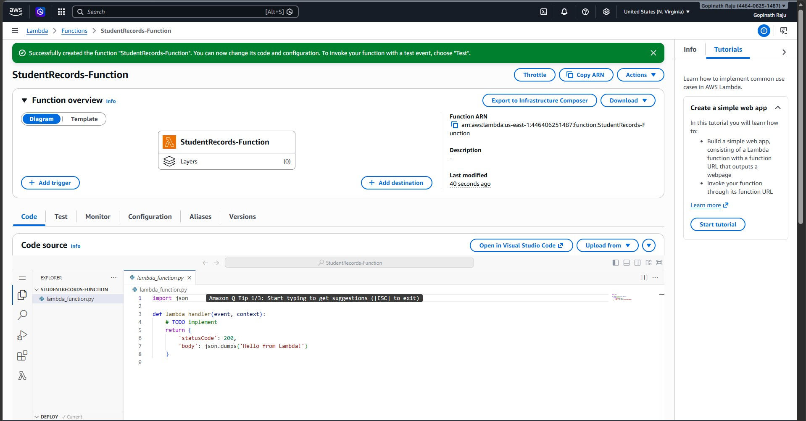
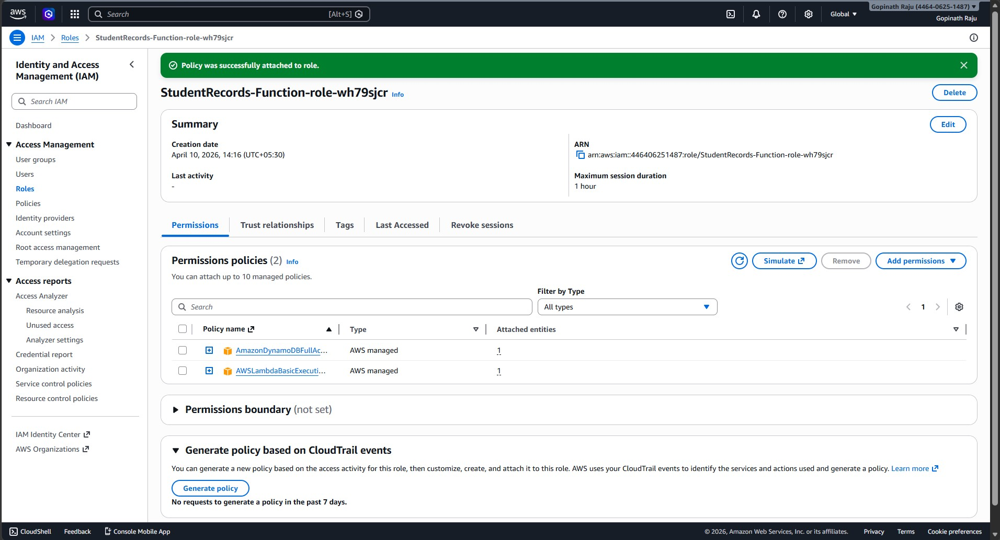
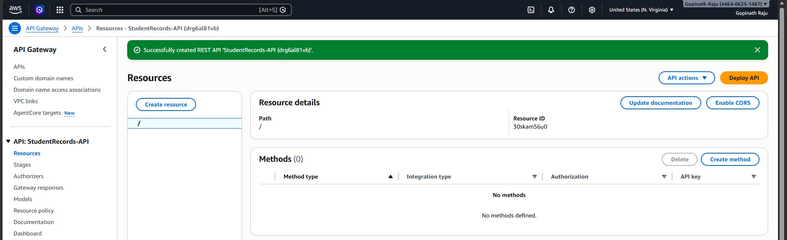
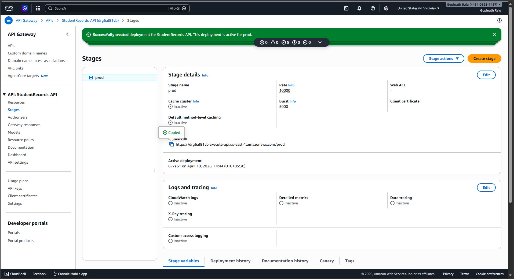
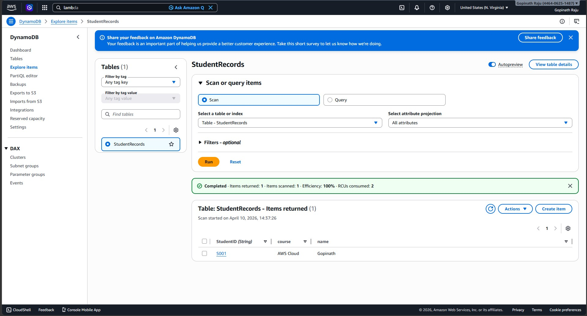
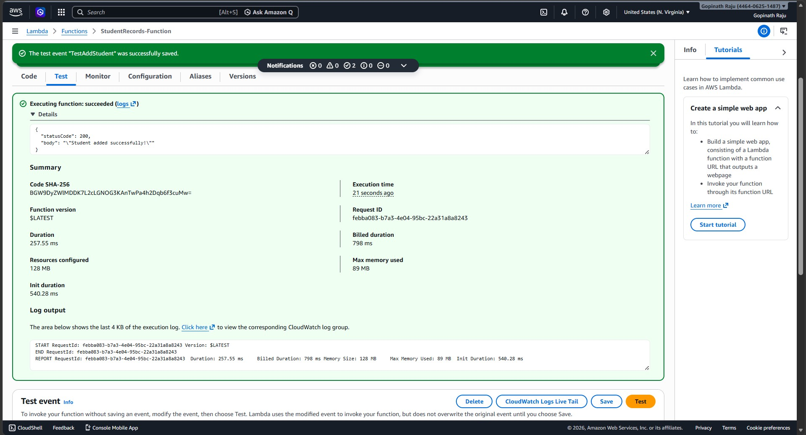
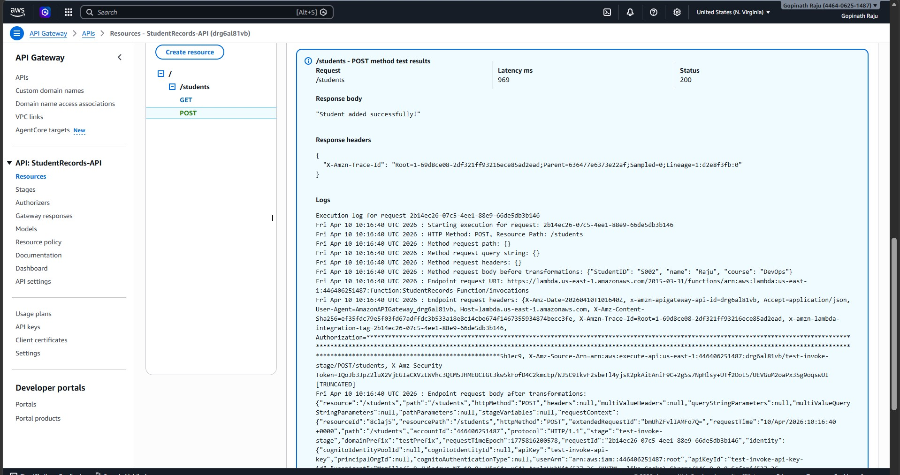

# ⚡ Project 5 — Serverless API with AWS Lambda, API Gateway & DynamoDB

## 📌 Project Overview

This project demonstrates how to build a **fully serverless REST API** on AWS — no servers to manage, no EC2 instances needed! A student record system was built using AWS Lambda, API Gateway, and DynamoDB that automatically scales and costs nothing at rest.

### Architecture Flow
```
User Request → API Gateway → Lambda Function → DynamoDB
     (URL)        (door)        (logic)         (database)
```

---

## 🎯 What Was Built

A **Student Records API** with two operations:
- **POST /students** — Add a new student record to DynamoDB
- **GET /students** — Retrieve a student record from DynamoDB

---

## 🛠️ AWS Services Used

| Service | Purpose |
|---|---|
| **AWS Lambda** | Serverless function — runs Python code without EC2 |
| **Amazon API Gateway** | REST API endpoint — public URL for the API |
| **Amazon DynamoDB** | NoSQL database — stores student records |
| **AWS IAM** | Role — gives Lambda permission to access DynamoDB |
| **Amazon CloudWatch** | Automatic logging of Lambda execution |

---

## 📋 Project Configuration

| Detail | Value |
|---|---|
| Region | `us-east-1` (N. Virginia) |
| Lambda Function | `StudentRecords-Function` |
| Runtime | Python 3.12 |
| DynamoDB Table | `StudentRecords` |
| Partition Key | `StudentID` (String) |
| API Name | `StudentRecords-API` |
| API Stage | `prod` |
| API URL | `https://drg6al81vb.execute-api.us-east-1.amazonaws.com/prod` |

---

## 🐍 Lambda Function Code

```python
import json
import boto3

dynamodb = boto3.resource('dynamodb')
table = dynamodb.Table('StudentRecords')

def lambda_handler(event, context):
    http_method = event['httpMethod']

    # POST - Add student
    if http_method == 'POST':
        body = json.loads(event['body'])
        table.put_item(Item={
            'StudentID': body['StudentID'],
            'name': body['name'],
            'course': body['course']
        })
        return {
            'statusCode': 200,
            'body': json.dumps('Student added successfully!')
        }

    # GET - Retrieve student
    elif http_method == 'GET':
        student_id = event['queryStringParameters']['StudentID']
        response = table.get_item(Key={'StudentID': student_id})
        item = response.get('Item', {})
        return {
            'statusCode': 200,
            'body': json.dumps(item)
        }
```

---

## 🧪 API Testing

### POST — Add a Student
```bash
curl -X POST \
  "https://drg6al81vb.execute-api.us-east-1.amazonaws.com/prod/students" \
  -H "Content-Type: application/json" \
  -d '{"StudentID": "S001", "name": "Gopinath", "course": "AWS Cloud"}'
```

**Response:**
```json
"Student added successfully!"
```

### GET — Retrieve a Student
```bash
curl "https://drg6al81vb.execute-api.us-east-1.amazonaws.com/prod/students?StudentID=S001"
```

**Response:**
```json
{"StudentID": "S001", "name": "Gopinath", "course": "AWS Cloud"}
```

---

## 📸 Screenshots

### 1. DynamoDB Table Created


### 2. Lambda Function Created


### 3. IAM Role — DynamoDB Permission Attached


### 4. API Gateway Created


### 5. API Gateway Deployed to `prod` Stage


### 6. DynamoDB Record Verified (Explore Items)


### 7. Lambda Test — Success (200 OK)


### 8. API Gateway Test — Output (200 OK)


---

## 💡 Key Concepts Learned

- **Serverless Computing** — No servers to manage; AWS handles infrastructure automatically
- **AWS Lambda** — Event-driven functions that run only when triggered (pay per use)
- **API Gateway** — Creates RESTful API endpoints that trigger Lambda functions
- **DynamoDB** — Fully managed NoSQL database with automatic scaling
- **IAM Role for Lambda** — Grants Lambda secure access to DynamoDB without access keys
- **Lambda Proxy Integration** — API Gateway passes full HTTP request to Lambda directly
- **Debugging** — Fixed `ValidationException` by matching DynamoDB partition key case exactly

---


## 👨‍💻 Author

**Gopinath Raju**
AWS Cloud Practitioner - SAA
